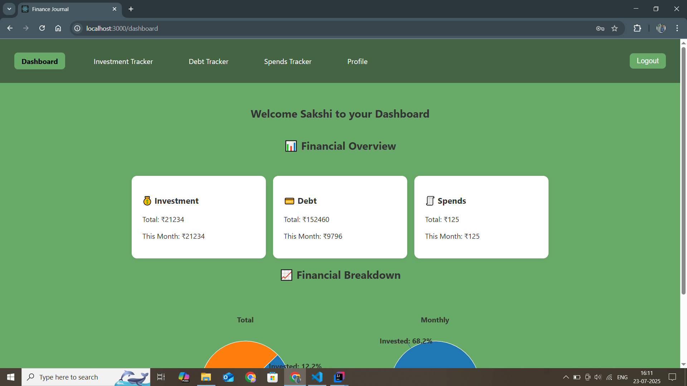

# finance-journal
A simple finance tracker made to track your expenses, investments and debts. Developed using Java Springboot for Backend and React for frontend..

## Current Features

- **Backend (Java/Spring Boot)**
  - Modularized services architecture
  - Separate Services are : User, Spends, Investement, Debt (WIP), Dashboard
  - Spring Security integration
  - Configurable CORS settings
  - Repository layer with JPA

- **Frontend (React)**
  - Initial component structure and navigation using React's JSX (HTML-like syntax) and CSS

## Getting Started

1. Clone the repository
2. Build backend services using Maven
3. Start the React development server
4. Connect frontend and backend as necessary

## Development

Planned updates and current in-progress work are tracked in [CHANGELOG.md](./CHANGELOG.md)

## How it looks (Screenshots)

Home Page:

Login Page:

Dashboard:

## License

This project is licensed under the [MIT License](./LICENSE) © 2025 Sakshi1608.

