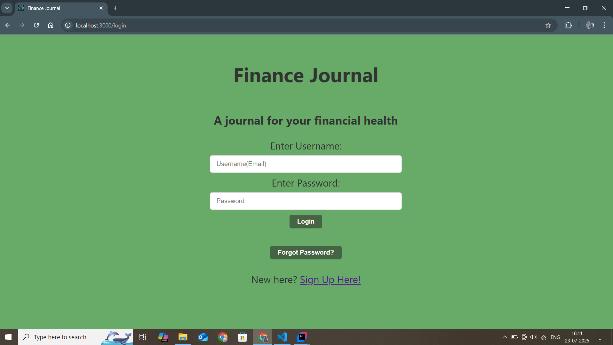

# finance-journal
A simple finance tracker made to track your expenses, investments and debts. Developed using Java Springboot for Backend and React for frontend..

## Current Features

- **Backend (Java/Spring Boot)**
  - Modularized services architecture
  - Separate Services are : User, Spends, Investement, Debt (WIP), Dashboard
  - Spring Security integration
  - Configurable CORS settings
  - Repository layer with JPA

- **Frontend (React)**
- Two UI options:
  - Simple HTML/React
  - Material UI

## Getting Started

1. Clone the repository
2. Build backend services using Maven
3. Start the React development server
4. Connect frontend and backend as necessary

### Frontend Options
 

**This project includes two alternative frontend implementations:**

#### 1. Simple HTML/React

- Path: `client/`
- Lightweight interface using basic React and plain CSS.

**To run:**
- cd client
- npm install
- npm start

#### How it looks (Screenshots)

Home Page:

Login Page:

Dashboard:

#### 2. Material UI

- Path: `frontend/`
- Modern interface using Material UI components.
- Has Light Mode Dark Mode theme support

**To run:**
- cd frontend
- npm install
- npm start

#### How it looks (Screenshots)

Home Page:

Login Page:

Dashboard:

**Switching between Frontends:**  
Stop one server and start the other using the steps above.

## Development

Planned updates and current in-progress work are tracked in [CHANGELOG.md](./CHANGELOG.md)

## License

This project is licensed under the [MIT License](./LICENSE) © 2025 Sakshi1608.

